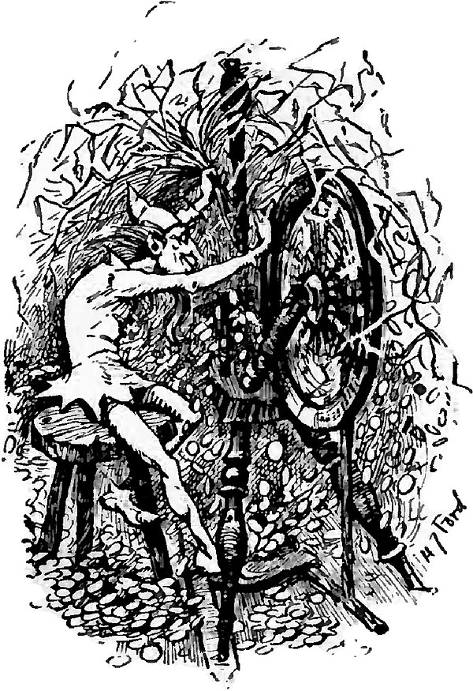

# Rumpelpod

Manage multiple independent workspaces of a repository in Docker or Podman containers, or Kubernetes pods, on local or remote hosts.
Designed for running LLM coding agents.

**Full documentation in the [user guide](GUIDE.md).**

```bash
curl -fsSL https://raw.githubusercontent.com/nvidia/rumpelpod/main/install.sh | sh
rumpel system-install
```

Requirements: git, Docker or Podman, optionally ssh and kubectl.

## What Is This?

Rumpelpod manages named, independent workspaces ("pods") of a repository inside containers.
Each pod has its own full clone of the repository, synced via git, so multiple agents can work concurrently without interfering with each other or your local machine.

Containers can run on the local Docker or Podman engine, on a remote Docker host via SSH, or on Kubernetes.
Rumpelpod handles git synchronization, port forwarding, and container lifecycle in all cases.

The main use case is running LLM coding agents.
Typical workflow:

1. Launch Claude Code in a pod with `rumpel claude my-task`, typically several in parallel on different tasks.
2. Each agent works autonomously inside its own container.
3. Review changes via git difftool with `rumpel review my-task`.
4. Merge results back with `rumpel merge my-task`.

Both Claude Code and OpenAI Codex are supported as first-class agents via `rumpel claude` and `rumpel codex`.
Rumpelpod is designed around iterating on multiple changes in parallel, reviewing each agent's work and asking for revisions until the change looks good.

Rumpelpod aims for minimal setup and compatibility with existing standards where configuration is necessary: project-tailored container images are defined using [devcontainer.json](https://containers.dev/), and compatibility with battle-tested secure runtimes such as gVisor and Kata Containers enables strong container isolation.

## Name

<a href="https://commons.wikimedia.org/wiki/File:The_Blue_Fairy_Book,_p._99.jpg">
  
</a>

Rumpelstiltskin (*rumpeln*: to rumble) is a productive but unruly Goblin from a Brothers Grimm fairy tale.
