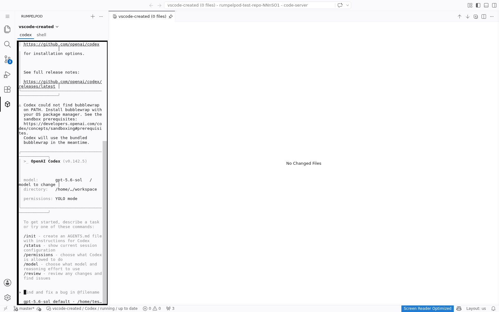
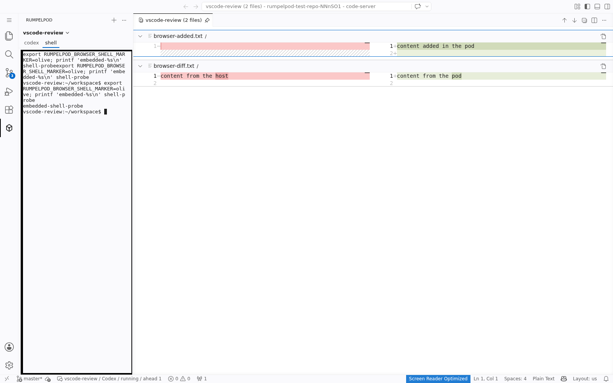
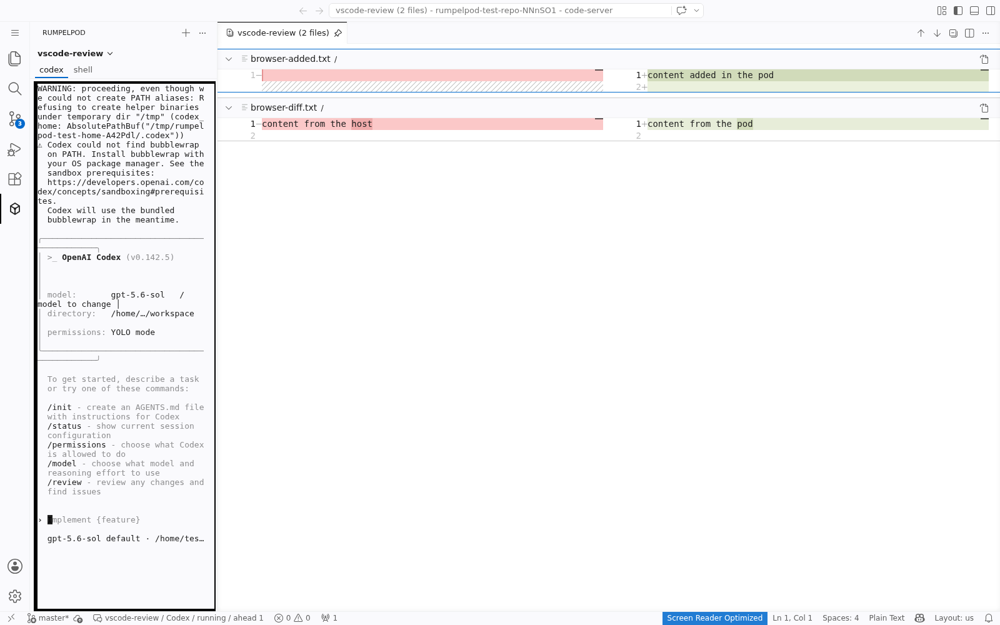

# Rumpelpod for VS Code

This workspace extension adds a Rumpelpod mode to the VS Code Activity Bar.
The mode renders the active agent and pod shell in xterm.js terminals shipped
by the extension and keeps them in the primary sidebar. The pod's review is a
native VS Code multi-diff in the main editor area. VS Code and the user's
`diffEditor.renderSideBySide` preference decide whether that diff is inline or
side by side.

Click the Rumpelpod Activity Bar icon to enter the mode. Click the pod name at
the top of the view to switch pods, and use the agent and shell tabs below it
to switch between the preserved extension-owned terminals. The view toolbar
creates pods; agent selection, refresh, and attachment restart commands are in
its overflow menu. The pod picker also has a `+` button.
Selecting a pod attaches the sidebar terminal to its configured agent and
opens every changed file on the right in one vertically stacked review. The
review is pinned, and the extension restores it if an explicit pinned-editor
close removes it. Pods without changed files still open a native empty review
surface instead of leaving the previous editor visible. Agent assignments and
the last active pod are saved across browser reloads.

## Development

The Rust type generator owns `src/generated/`. The repository tool regenerates
those bindings, packages the extension, rebuilds the development daemon,
installs both, and restarts the browser workspace:

```sh
cargo vscode
```

The devcontainer runs `cargo vscode` after creation and serves a dedicated
`anyhow` 1.0.102 demo repository from
`/workspaces/anyhow-demo` at port 3000. This keeps the live editor
outside the rumpelpod source checkout: pods created through the extension use
the demo's ordinary Rust devcontainer and do not try to nest Sysbox inside
Sysbox. The demo is seeded from Cargo's pinned registry source on first use;
later `cargo vscode` runs preserve its pods and working tree.

The server is unauthenticated and its address is fixed to the container
loopback interface, so it cannot be exposed on a container network interface.
Use the forwarded URL rather than trying to reach the container directly. When
this repository is itself inside a rumpelpod, run `rumpel ports POD_NAME` in
the parent checkout and open the local port labeled `Rumpelpod VS Code`;
rumpel also binds that forward only on the host loopback interface.

Use `npm run watch` for fast TypeScript compilation feedback. Run `cargo
vscode` to put any change into the live browser workspace; it refreshes the
daemon, generated contracts, installed VSIX, and user service files, then waits
until the browser service is healthy. `cargo vscode --check` performs the
extension checks used by the Rust pipeline without updating either live
service.

The embedded terminal uses a native PTY binding. `npm run package` labels the
VSIX for the current operating system and architecture and includes the binding
built on that host. Development VSIX files are therefore current-host artifacts,
not universal packages; Linux artifacts also require a compatible C library.
Build the VSIX on the deployment host or in a release container whose C library
is no newer than the supported deployment environments.

The browser integration test launches an isolated code-server instance and a
real rumpelpod daemon, then drives the packaged extension with Playwright. Run
it through the normal test pipeline:

```sh
cargo pipeline vscode_browser_lists_creates_and_reviews_pods
```

Successful runs capture the Activity Bar mode, pod switcher, agent picker,
pod-name prompt, embedded Codex and shell terminals, terminal-plus-review
layout, restored terminal, and a Playwright trace under
`target/vscode-integration/`. To refresh the checked-in reference images while
running the same test, use:

```sh
RUMPELPOD_VSCODE_REFERENCE_IMAGES="$PWD/vscode/docs/images" \
    cargo pipeline vscode_browser_lists_creates_and_reviews_pods
```

The creation flow reaches a real Codex prompt while the daemon reports the new
pod as running:



The shell tab uses a second extension-owned xterm and keeps the agent attached:



The test then makes a real commit inside the active pod. The daemon event
updates both the status item and the review without a manual refresh:


